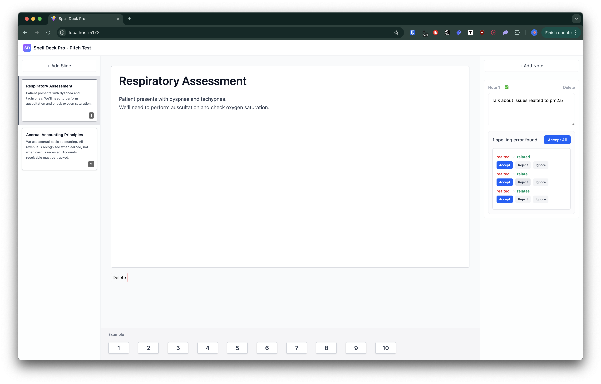

# Spell Deck Pro

A proof-of-concept, contextual spell checker.



## Features

- Create and manage multiple slides
- Multiple speaker notes per slide
- Contextual AI-powered spell checking
- Real-time spell check status indicators
- Optimizations to minimize AI token usage

## Strategy

Spell Deck Pro uses a two-stage spell checking system. It combines fast browser-based checking with context-aware AI analysis.

### How It Works

1. **User types in speaker note** → Content is debounced (default: 2 seconds)
2. **Stage 1: Browser Spell Check** → Fast, free dictionary-based check using `typo-js`
3. **If errors found** → **Stage 2: AI Context-Aware Check** → Claude Haiku analyzes with slide context
4. **Display recommendations** → User can replace, ignore, or accept all suggestions

The Claude Haiku model is used since no complex reasoning is required.

### Optimizations

#### 1. Significant Change Detection

- Only triggers spell check when content changes significantly:
  - More than 10 characters difference, OR
  - Word count changes
- Uses React refs to track previous content without causing re-renders
- Monitors both note content changes and slide content changes

**Benefit**: Avoids redundant spell checks for minor edits (e.g., single character changes, cursor movements).

#### 2. Dictionary Caching

- Browser spell checker dictionary (`typo-js`) is loaded once on first use
- Dictionary instance is cached and reused for all subsequent checks
- Lazy-loaded only when needed

**Benefit**: Eliminates repeated dictionary loading, improving performance of Stage 1 checks.

#### 3. Spelling Errors Maintained in Global State

- Each note, slide, and spelling suggestion on note is in the global state
- State is maintained on navigation, preventing redundant spell check calls

### User Interactions

Users can interact with spell check results in several ways:

- **Replace**: Replace a misspelled word with a suggested correction (replaces all occurrences in the textarea)
- **Ignore**: Mark a word as ignored (removed from error list, persists during session)
- **Accept All**: Apply all corrections at once using the first suggestion for each error
- **Reject Suggestion**: Dismiss specific suggestions

### Implementation Details

The spell checking system is implemented as pure functions in `src/services/spellCheckService/`:

- `browserSpellChecker.ts`: Stage 1 browser-based checking
- `aiSpellChecker.ts`: Stage 2 AI-powered context-aware checking
- `contextAwareSpellCheck.ts`: Orchestrator that coordinates both stages

See [`checkplan.md`](./checkplan.md) to view my process on prompting Claude to build this feature.

## Context-Aware Spellings

Since the content of the slide is considered while suggesting spellings, the suggestions feel natural.

For example, if you add the following content and speaker note, the word "mah" will be considered fine:

title: Eminem's top works
body:

- Slim shady is one of Eminem's top tracks
- It starts with, "Ha, mah name is, Ha..."
- He uses the word "my" as "mah" to maintain his flow

note:

- introduce yourself by saying, "mah name is Shivek"

But if you remove the content, the word "my" will be suggested as a replacement for "mah".

## Tech Stack

- **Build Tool**: Vite
- **Runtime**: Bun
- **Language**: TypeScript
- **Frontend Framework**: ReactJS (SPA mode)
- **State Management**: Jotai
- **AI Integration**: AI SDK (Vercel AI SDK)
- **Styling**: Tailwind CSS

## Setup

1. Install dependencies:

   ```bash
   bun install
   ```

2. Configure environment variables:
   Create a `.env` file with the following variables:

   ```bash
   VITE_ANTHROPIC_API_KEY=your_anthropic_api_key_here
   VITE_SPELL_CHECK_MODEL=claude-3-haiku-20240307
   VITE_SPELL_CHECK_DEBOUNCE_MS=2000
   ```

   A sample `.env` file is provided in the git tree.

3. Start the development server:

   ```bash
   bun run dev
   ```

4. Build for production:
   ```bash
   bun run build
   ```

## Environment Variables

Required environment variables:

- `VITE_ANTHROPIC_API_KEY`: Your Anthropic/Claude API key (required for AI spell checking)
- `VITE_SPELL_CHECK_MODEL`: Model to use for spell checking (default: `claude-3-haiku-20240307`)
- `VITE_SPELL_CHECK_DEBOUNCE_MS`: Debounce delay in milliseconds (default: 2000)

**Note**: In Vite, environment variables must be prefixed with `VITE_` to be exposed to client-side code.

## Project Structure

```
src/
├── components/    # React components
├── atoms/         # Jotai state atoms
├── services/      # Business logic services
├── utils/         # Utility functions
├── App.tsx        # Main app component
└── main.tsx       # Entry point
```

## Development

The project follows functional programming principles:

- Pure functions where possible
- Immutable state updates
- Functional composition
- No direct mutations

Code is automatically formatted with Prettier on save.

## Known tradeoffs

- Multiple speaker notes might send multiple AI requests. This can be combined into one request with a better prompt.
- React components are not well organized and may render more than needed
- The AI model sometimes returns the same spelling as a suggestion (try the word "Zeevek")

## Development logs

1. UI scaffolding and Project setup: 1 hour
2. Test cases, and spellchecker logic: 1 hour
3. Spending time on browser based wasm checker: 2 hours (wasted / the package was unmaintained)
4. Correcting debounce logic, simplifying components, UI fixes (1 hour)
5. Documentation and submission (1 hour)

## License

MIT
